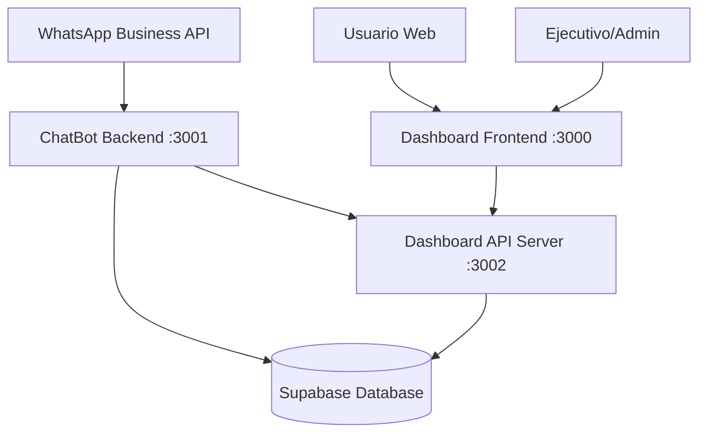
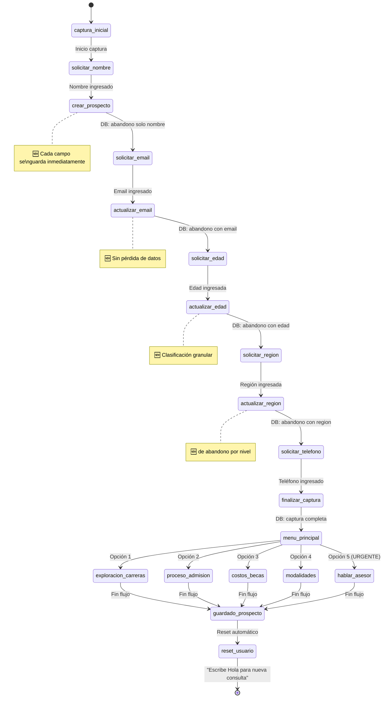
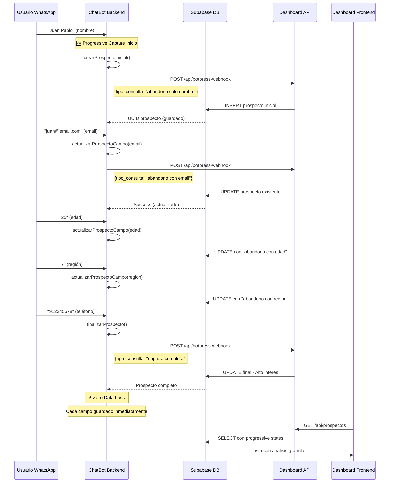
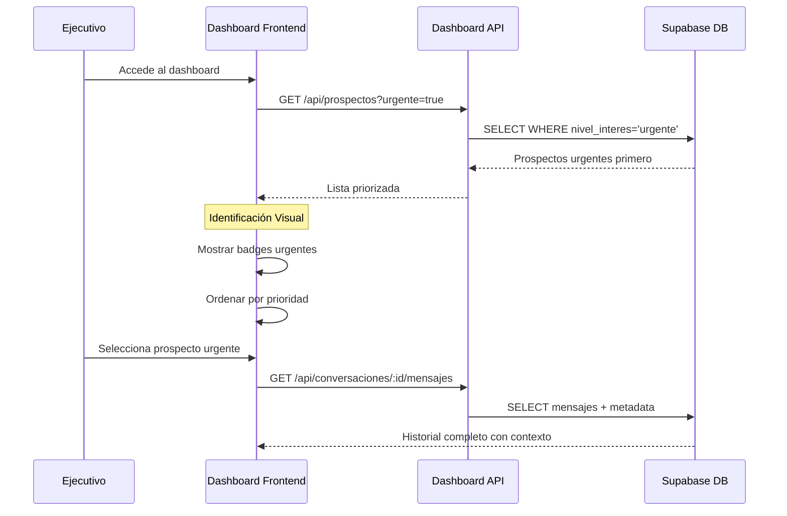

# 🏗️ Arquitectura del Sistema ChatBot UNIACC

**Autor:** Juan Pablo Silva feat Claude AI

## 📋 Índice
1. [Visión General](#vision-general)
2. [Arquitectura de Microservicios](#arquitectura-de-microservicios)
3. [Chatbot Backend](#chatbot-backend)
4. [Dashboard Frontend](#dashboard-frontend)
5. [Dashboard API Server](#dashboard-api-server)
6. [Base de Datos (Supabase)](#base-de-datos-supabase)
7. [Flujo de Datos](#flujo-de-datos)
8. [Configuración de Puertos](#configuracion-de-puertos)
9. [Variables de Entorno](#variables-de-entorno)
10. [Estructura de Archivos](#estructura-de-archivos)

---

## 🎯 Visión General

El sistema ChatBot UNIACC está diseñado como una arquitectura de microservicios que permite:
- **🆕 Progressive Capture System** - Zero data loss con captura incremental campo por campo
- **Captura automática de prospectos** a través de WhatsApp con sistema anti-duplicados
- **Gestión centralizada** de conversaciones y prospectos con clasificación granular de abandono
- **Dashboard en tiempo real** para seguimiento de leads con análisis de abandono progresivo
- **Integración con Supabase** para persistencia de datos con constraints avanzados
- **Sistema de timeout inteligente** que preserva datos parciales



---

## 🔧 Arquitectura de Microservicios

### Servicios Principales

| Servicio | Puerto | Tecnología | Propósito |
|----------|--------|------------|-----------|
| **ChatBot Backend** | 3001 | Node.js + TypeScript | Bot de WhatsApp con sistema anti-duplicados |
| **Dashboard API Server** | 3002 | Node.js + Express | API REST con mapeo de tipos de consulta |
| **Dashboard Frontend** | 3000 | Vue.js + Vite | Interfaz web con identificación de urgencia |

### Servicios Externos

| Servicio | URL | Propósito |
|----------|-----|-----------|
| **Supabase** | https://vtwdmyezyvhprwonengu.supabase.co | Base de datos PostgreSQL con constraints |
| **WhatsApp Business API** | Meta Platform | Integración de mensajería |

---

## 🤖 Chatbot Backend

### **Puerto:** 3001
### **Tecnología:** Node.js + TypeScript + Express

```
chatbot/
├── src/
│   ├── actions/
│   │   ├── uniacc-scripts.ts      # Lógica principal del bot + anti-duplicados
│   │   └── supabase-integration.ts # Integración con Supabase
│   ├── data/
│   │   ├── programas-uniacc.ts    # Datos de facultades y carreras
│   │   └── respuestas-predefinidas.ts # Respuestas del bot
│   ├── utils/
│   │   └── supabase-client.ts     # Cliente de Supabase
│   └── index.ts                   # Servidor principal
├── .env                           # Variables de entorno
├── package.json
└── tsconfig.json
```

### **Endpoints Principales:**

#### 🔗 API Endpoints
- **GET** `/` - Página principal del bot
- **GET** `/chat` - Interfaz de chat interactiva
- **POST** `/webhook` - Webhook para WhatsApp Business API
- **POST** `/test-chat` - Endpoint para testing del chat
- **GET** `/health` - Health check
- **GET** `/stats` - Estadísticas del bot

#### 🧠 Funcionalidades Clave
- **Gestión de Estado:** Manejo de conversaciones por usuario con reset automático
- **Sistema Anti-Duplicados:** 1 prospecto por flujo completado
- **Flujos Conversacionales:** 
  - Captura inicial de datos con validaciones
  - Exploración de carreras por facultad
  - Proceso de admisión 2025
  - Información de costos y becas
  - Modalidades de estudio
  - Solicitud de asesor (nivel urgente)
- **Reinicio Automático:** Reset del usuario post-guardado
- **Integración WhatsApp:** Procesamiento de mensajes entrantes
- **Persistencia:** Guardado de prospectos en Supabase con mapeo de tipos

#### 🔄 Flujo de Conversación con Progressive Capture


#### 🎯 Sistema de Clasificación de Prospectos
- **Consulta General** - Flujo básico informativo
- **Exploración de Carreras** - Interés académico específico  
- **Proceso de Admisión** - Información sobre ingreso
- **Costos y Becas** - Interés en financiamiento
- **Modalidades de Estudio** - Interés en formatos de estudio
- **Solicitud de Asesor** - Prioridad URGENTE

#### 🆕 Progressive Capture States (NUEVO)
1. **🔄 captura en proceso** - Usuario iniciando captura de datos
2. **⚠️ abandono solo nombre** - Usuario ingresó solo nombre y abandonó
3. **⚠️ abandono con email** - Usuario llegó hasta email y abandonó
4. **⚠️ abandono con edad** - Usuario llegó hasta edad y abandonó
5. **⚠️ abandono con region** - Usuario llegó hasta región y abandonó
6. **❌ abandono incompleto** - Abandono sin datos suficientes
7. **✅ captura completa** - Usuario completó todos los campos básicos

---

## 🎨 Dashboard Frontend

### **Puerto:** 3000
### **Tecnología:** Vue.js 3 + Vite + TypeScript

```
dashboard/
├── src/
│   ├── components/
│   │   ├── chat/
│   │   │   ├── ChatInterface.vue    # Interfaz principal de chat
│   │   │   ├── ChatSidebar.vue      # Lista de conversaciones
│   │   │   └── MessageInput.vue     # Input de mensajes
│   │   ├── layout/
│   │   │   ├── Header.vue           # Header principal
│   │   │   └── Sidebar.vue          # Navegación lateral
│   │   └── prospectos/
│   │       ├── ProspectosList.vue   # Lista con filtros de urgencia
│   │       └── ProspectoDetail.vue  # Detalle de prospecto
│   ├── composables/
│   │   ├── useChat.ts               # Lógica de chat
│   │   ├── useProspectos.ts         # Gestión de prospectos
│   │   ├── useMetricas.ts           # Métricas y estadísticas
│   │   ├── useSupabase.ts           # Cliente Supabase
│   │   └── useEjecutivos.ts         # Gestión de ejecutivos
│   ├── views/
│   │   ├── Dashboard.vue            # Dashboard principal
│   │   ├── Chat.vue                 # Vista de chat
│   │   ├── ProspectosView.vue       # Gestión con filtros
│   │   └── Metricas.vue             # Análisis y métricas
│   ├── types/
│   │   └── index.ts                 # Tipos TypeScript
│   └── main.ts                      # Entrada de la aplicación
├── vite.config.ts                   # Configuración de Vite
└── package.json
```

### **Características Principales:**
- **Chat en Tiempo Real:** Interfaz para gestionar conversaciones
- **Gestión de Prospectos:** CRUD completo de leads con identificación visual de urgencia
- **Filtros Avanzados:** Por tipo de consulta y nivel de interés
- **Métricas y Analytics:** Dashboards con estadísticas de conversión
- **Identificación de Urgencia:** Destacado visual de prospectos urgentes
- **Responsive Design:** Optimizado para desktop y mobile
- **TypeScript:** Tipado fuerte para mejor desarrollo

---

## 🔌 Dashboard API Server

### **Puerto:** 3002
### **Tecnología:** Node.js + Express

```
dashboard/
├── server.js                        # Servidor API con lógica de mapeo
├── package.json
└── .env
```

### **Endpoints API:**

#### 📊 Prospectos y Webhooks
- **POST** `/api/interacciones` - Registrar interacción del bot
- **POST** `/api/botpress-webhook` - Webhook principal para prospectos
- **GET** `/api/prospectos` - Listar todos los prospectos

#### 💬 Conversaciones
- **GET** `/api/conversaciones` - Listar conversaciones
- **GET** `/api/conversaciones/:id/mensajes` - Mensajes de una conversación

#### 📊 Estadísticas
- **GET** `/api/stats` - Métricas generales del sistema

#### 🔧 Sistema
- **GET** `/health` - Health check del API

### **Funcionalidades Avanzadas:**
- **Mapeo Automático de Tipos de Consulta:**
  - `consulta_general` → `consulta general`
  - `costos_becas` → `consulta costos y/o becas`
  - `modalidades_estudio` → `consulta modalidades de estudio`
  - `hablar_asesor` → `solicitud de asesor`
- **Gestión de Niveles de Interés:**
  - Automático: `alto` para consultas generales
  - Prioritario: `urgente` para solicitudes de asesor
- **Validación de Constraints:** Verificación de valores permitidos
- **Proxy para Supabase:** Manejo seguro de conexiones a BD
- **Gestión de Errores:** Respuestas estructuradas de error
- **CORS Configurado:** Permite conexiones desde el frontend

---

## 🗄️ Base de Datos (Supabase)

### **URL:** https://vtwdmyezyvhprwonengu.supabase.co
### **Tecnología:** PostgreSQL + Supabase

### **Esquema de Tablas Actualizado:**

#### 👥 **prospectos** (Tabla Principal)
```sql
CREATE TABLE prospectos (
  id                    uuid                     DEFAULT gen_random_uuid() NOT NULL PRIMARY KEY,
  created_at            timestamp with time zone DEFAULT now(),
  updated_at            timestamp with time zone DEFAULT now(),
  nombre                text                                               NOT NULL,
  email                 text
    CONSTRAINT valid_email
      CHECK ((email ~ '^[^@]+@[^@]+\.[^@]+$'::text) OR (email IS NULL)),
  telefono              text,
  whatsapp              text                                               NOT NULL
    CONSTRAINT valid_whatsapp
      CHECK (whatsapp ~ '^\+?[0-9]{8,15}$'::text),
  edad                  integer,
  ocupacion             text,
  carrera_interes       text,
  nivel_educacion       text,
  experiencia_previa    text,
  region                text,
  ciudad                text,
  pais                  text                     DEFAULT 'Chile'::text,
  estado                text                     DEFAULT 'nuevo'::text
    CONSTRAINT prospectos_estado_check
      CHECK (estado = ANY (ARRAY ['nuevo'::text, 'contactado'::text, 'interesado'::text, 'matriculado'::text, 'descartado'::text])),
  nivel_interes         text                     DEFAULT 'medio'::text
    CONSTRAINT prospectos_nivel_interes_check
      CHECK (nivel_interes = ANY (ARRAY ['bajo'::text, 'medio'::text, 'alto'::text, 'muy_alto'::text, 'urgente'::text])),
  assigned_to           uuid REFERENCES ejecutivos,
  ejecutivo_asignado_at timestamp with time zone,
  fuente                text                     DEFAULT 'whatsapp_bot'::text
    CONSTRAINT prospectos_fuente_check
      CHECK (fuente = ANY (ARRAY ['whatsapp_bot'::text, 'web_form'::text, 'facebook_ads'::text, 'google_ads'::text, 'referido'::text, 'uniacc_chatbot'::text, 'demo_chatbot'::text, 'asesor_request'::text])),
  metadata              jsonb                    DEFAULT '{}'::jsonb,
  notas                 text,
  tags                  text[],
  ultimo_contacto       timestamp with time zone,
  proximo_seguimiento   timestamp with time zone,
  facultad_interes      text,
  tipo_consulta         text                     DEFAULT 'consulta_general'::text NOT NULL
    CONSTRAINT prospectos_tipo_consulta_check
      CHECK (tipo_consulta = ANY (ARRAY [
        -- Valores originales
        'info_carreras'::text, 'info_admision'::text, 'info_costos'::text,
        'info_modalidades'::text, 'solicitar_asesor'::text, 'ingreso solo datos basicos'::text,
        'consulta multiple carrera especifica'::text, 'consulta multiple general'::text,
        -- 🆕 Nuevos valores para progressive capture
        'captura en proceso'::text, 'abandono solo nombre'::text, 'abandono con email'::text,
        'abandono con edad'::text, 'abandono con region'::text, 'abandono incompleto'::text,
        'captura completa'::text
      ]))
);

COMMENT ON COLUMN prospectos.tipo_consulta IS '🆕 PROGRESSIVE CAPTURE: Tipo de consulta con estados granulares de captura. Incluye 7 estados de progressive capture desde "abandono solo nombre" hasta "captura completa" para análisis detallado de abandono por campo.';
```

#### 👨‍💼 **ejecutivos** (Gestión de Asesores)
```sql
CREATE TABLE ejecutivos (
  id                         uuid                     DEFAULT gen_random_uuid() NOT NULL PRIMARY KEY,
  created_at                 timestamp with time zone DEFAULT now(),
  updated_at                 timestamp with time zone DEFAULT now(),
  nombre                     text                                               NOT NULL,
  email                      text                                               NOT NULL UNIQUE
    CONSTRAINT valid_email
      CHECK (email ~ '^[^@]+@[^@]+\.[^@]+$'::text),
  telefono                   text,
  avatar_url                 text,
  carreras_especializacion   text[]                   DEFAULT '{}'::text[],
  regiones_cobertura         text[]                   DEFAULT '{}'::text[],
  max_prospectos_simultaneos integer                  DEFAULT 50
    CONSTRAINT valid_max_prospectos
      CHECK (max_prospectos_simultaneos > 0),
  prospectos_activos         integer                  DEFAULT 0,
  tasa_conversion            numeric(5, 2)            DEFAULT 0.00,
  total_conversiones         integer                  DEFAULT 0,
  horario_inicio             time                     DEFAULT '09:00:00'::time without time zone,
  horario_fin                time                     DEFAULT '18:00:00'::time without time zone,
  timezone                   text                     DEFAULT 'America/Santiago'::text,
  dias_trabajo               integer[]                DEFAULT '{1,2,3,4,5}'::integer[],
  activo                     boolean                  DEFAULT true,
  disponible                 boolean                  DEFAULT true,
  ultimo_login               timestamp with time zone,
  configuracion              jsonb                    DEFAULT '{}'::jsonb
);
```

#### 💬 **conversaciones** (Gestión de Chats)
```sql
CREATE TABLE conversaciones (
  id              uuid                     DEFAULT gen_random_uuid() NOT NULL PRIMARY KEY,
  created_at      timestamp with time zone DEFAULT now(),
  updated_at      timestamp with time zone DEFAULT now(),
  external_id     text UNIQUE,
  phone_number    text                                               NOT NULL,
  contact_name    text,
  prospecto_id    uuid REFERENCES prospectos,
  assigned_to     uuid REFERENCES ejecutivos,
  status          text                     DEFAULT 'active'::text
    CONSTRAINT conversaciones_status_check
      CHECK (status = ANY (ARRAY ['active'::text, 'paused'::text, 'closed'::text, 'archived'::text])),
  last_message_at timestamp with time zone DEFAULT now(),
  message_count   integer                  DEFAULT 0,
  unread_count    integer                  DEFAULT 0,
  contact_info    jsonb                    DEFAULT '{}'::jsonb,
  tags            text[]                   DEFAULT '{}'::text[],
  priority        text                     DEFAULT 'normal'::text
    CONSTRAINT conversaciones_priority_check
      CHECK (priority = ANY (ARRAY ['low'::text, 'normal'::text, 'high'::text, 'urgent'::text])),
  notas           text
);
```

#### 📝 **mensajes** (Historial de Conversaciones)
```sql
CREATE TABLE mensajes (
  id              uuid                     DEFAULT gen_random_uuid() NOT NULL PRIMARY KEY,
  created_at      timestamp with time zone DEFAULT now(),
  conversacion_id uuid REFERENCES conversaciones ON DELETE CASCADE,
  external_id     text,
  content         text                                               NOT NULL,
  message_type    text                     DEFAULT 'text'::text
    CONSTRAINT mensajes_message_type_check
      CHECK (message_type = ANY (ARRAY ['text'::text, 'image'::text, 'document'::text, 'audio'::text, 'video'::text, 'location'::text, 'contact'::text])),
  type            text                                               NOT NULL
    CONSTRAINT mensajes_type_check
      CHECK (type = ANY (ARRAY ['user'::text, 'bot'::text, 'agent'::text])),
  sender_id       text,
  sender_name     text,
  is_read         boolean                  DEFAULT false,
  delivered_at    timestamp with time zone,
  read_at         timestamp with time zone,
  metadata        jsonb                    DEFAULT '{}'::jsonb
);
```

### **Índices Optimizados:**
```sql
-- Índices para prospectos urgentes
CREATE INDEX idx_prospectos_urgentes
  ON prospectos (tipo_consulta, nivel_interes, created_at)
  WHERE (tipo_consulta = 'solicitud de asesor'::text);

CREATE INDEX idx_prospectos_tipo_consulta
  ON prospectos (tipo_consulta);

-- Índices básicos
CREATE INDEX idx_prospectos_whatsapp ON prospectos (whatsapp);
CREATE INDEX idx_prospectos_email ON prospectos (email);
CREATE INDEX idx_prospectos_estado ON prospectos (estado);
CREATE INDEX idx_prospectos_fuente ON prospectos (fuente);
CREATE INDEX idx_prospectos_created_at ON prospectos (created_at);
```

### **Funciones RPC Avanzadas:**

#### 🔄 **upsert_prospecto_por_whatsapp**
```sql
CREATE FUNCTION upsert_prospecto_por_whatsapp(
  p_whatsapp text, 
  p_nombre text, 
  p_email text DEFAULT NULL,
  p_edad integer DEFAULT NULL,
  p_region text DEFAULT NULL,
  p_telefono text DEFAULT NULL,
  p_carrera_interes text DEFAULT NULL,
  p_facultad_interes text DEFAULT NULL
) RETURNS uuid
SECURITY DEFINER
LANGUAGE plpgsql
```
**Propósito:** Crear o actualizar prospecto sin duplicados por WhatsApp.

#### 📊 **get_prospectos_stats**
```sql
CREATE FUNCTION get_prospectos_stats() RETURNS json
SECURITY DEFINER
LANGUAGE plpgsql
```
**Propósito:** Obtener estadísticas completas de prospectos con tasas de conversión.

### **Triggers Automáticos:**
- **update_updated_at_column()** - Actualiza timestamp automáticamente
- **update_ejecutivo_prospectos_count()** - Mantiene contadores actualizados
- **update_fuente_stats()** - Calcula estadísticas de fuentes

---

## 📊 Flujo de Datos Actualizado

### **🆕 Progressive Capture Flow con Zero Data Loss:**


### **Gestión desde Dashboard con Urgencia:**


---

## 🚪 Configuración de Puertos

| Puerto | Servicio | URL | Estado |
|--------|----------|-----|--------|
| **3000** | Dashboard Frontend | http://localhost:3000 | ✅ Desarrollo |
| **3001** | ChatBot Backend | http://localhost:3001 | ✅ Desarrollo |
| **3002** | Dashboard API Server | http://localhost:3002 | ✅ Desarrollo |

### **Configuración Proxy (Vite):**
```typescript
// dashboard/vite.config.ts
server: {
  port: 3000,
  proxy: {
    '/api': {
      target: 'http://localhost:3002',
      changeOrigin: true,
      secure: false
    }
  }
}
```

### **Scripts de Desarrollo:**
```json
{
  "scripts": {
    "dev:full": "concurrently \"npm run dev\" \"npm run dev:api\"",
    "dev": "vite --host",
    "dev:api": "node server.js"
  }
}
```

---

## 🔐 Variables de Entorno

### **ChatBot Backend (.env)**
```env
# Servidor
NODE_ENV=development
BOT_PORT=3001
BOT_HOST=localhost

# WhatsApp Business API
WHATSAPP_VERIFY_TOKEN=uniacc_verify_token_123
WHATSAPP_ACCESS_TOKEN=tu_whatsapp_access_token
WHATSAPP_PHONE_NUMBER_ID=tu_phone_number_id
WHATSAPP_WEBHOOK_SECRET=tu_webhook_secret

# Dashboard Integration (ACTUALIZADO)
VUE_WEBHOOK_URL=http://localhost:3002/api/botpress-webhook
VUE_WEBHOOK_SECRET=uniacc_webhook_secret_123

# Supabase
SUPABASE_URL=https://vtwdmyezyvhprwonengu.supabase.co
SUPABASE_ANON_KEY=eyJhbGciOiJIUzI1NiIsInR5cCI6IkpXVCJ9...

# UNIACC
UNIACC_WEBSITE=https://www.uniacc.cl
UNIACC_CONTACT_EMAIL=admision@uniacc.cl
UNIACC_PHONE=+56226406000

# Logging
LOG_LEVEL=info
LOG_FILE=logs/bot.log
```

### **Dashboard API Server (.env)**
```env
# Supabase (sin prefijo VITE_)
VITE_SUPABASE_URL=https://vtwdmyezyvhprwonengu.supabase.co
VITE_SUPABASE_ANON_KEY=eyJhbGciOiJIUzI1NiIsInR5cCI6IkpXVCJ9...
VITE_UNIACC_WEBHOOK_SECRET=uniacc_webhook_secret_123
```

### **Dashboard Frontend (.env)**
```env
# Supabase (con prefijo VITE_)
VITE_SUPABASE_URL=https://vtwdmyezyvhprwonengu.supabase.co
VITE_SUPABASE_ANON_KEY=eyJhbGciOiJIUzI1NiIsInR5cCI6IkpXVCJ9...
VITE_PORT=3000
```

---

## 📁 Estructura de Archivos

```
chatboot-uniacc/
├── 📁 chatbot/                     # Backend del ChatBot
│   ├── 📁 src/
│   │   ├── 📁 actions/
│   │   │   ├── 📄 uniacc-scripts.ts          # Sistema anti-duplicados
│   │   │   └── 📄 supabase-integration.ts    # Integración avanzada
│   │   ├── 📁 data/
│   │   │   ├── 📄 programas-uniacc.ts        # Datos UNIACC
│   │   │   └── 📄 respuestas-predefinidas.ts # Respuestas del bot
│   │   ├── 📁 utils/
│   │   │   └── 📄 supabase-client.ts         # Cliente configurado
│   │   └── 📄 index.ts                       # Servidor principal
│   ├── 📄 .env
│   ├── 📄 package.json
│   └── 📄 tsconfig.json
├── 📁 dashboard/                   # Frontend y API del Dashboard
│   ├── 📁 src/                     # Frontend Vue.js
│   │   ├── 📁 components/
│   │   ├── 📁 composables/
│   │   ├── 📁 views/
│   │   │   └── 📄 ProspectosView.vue         # Vista con urgencias
│   │   └── 📄 main.ts
│   ├── 📁 src/server/api/          # Lógica de API separada
│   │   └── 📄 botpress-webhook.ts            # Webhook principal
│   ├── 📄 server.js               # API Server con mapeo
│   ├── 📄 vite.config.ts
│   └── 📄 package.json
├── 📁 .claude/                     # Archivos de configuración
│   ├── 📄 supabase_config_actual.sql        # Schema actualizado
│   └── 📄 project-context.json              # Contexto del proyecto
├── 📄 arquitectura.md             # Este archivo
└── 📄 README.md                   # Documentación principal
```

---

## 🚀 Comandos de Desarrollo

### **Levantar todos los servicios:**

```bash
# Opción 1: Todo en uno (RECOMENDADO)
cd dashboard
npm run dev:full

# Opción 2: Por separado (3 terminales)
# Terminal 1: ChatBot Backend
cd chatbot
npm run dev

# Terminal 2: Dashboard API Server  
cd dashboard
npm run dev:server

# Terminal 3: Dashboard Frontend
cd dashboard
npm run dev
```

### **Comandos útiles:**

```bash
# Build para producción
npm run build

# Verificar tipos TypeScript
npm run typecheck

# Ejecutar tests
npm run test

# Logs del sistema
tail -f chatbot/logs/bot.log

# Limpiar y reinstalar dependencias
rm -rf node_modules && npm install
```

---

## 🔧 Consideraciones Técnicas Actualizadas

### **Escalabilidad:**
- ✅ Arquitectura de microservicios
- ✅ Base de datos PostgreSQL escalable con índices optimizados
- ✅ API REST stateless con sistema anti-duplicados
- ✅ Sistema de clasificación de prioridades
- 🔄 Redis para caché (futuro)
- 🔄 Load balancer (futuro)

### **Seguridad:**
- ✅ Variables de entorno para secretos
- ✅ Constraints de base de datos actualizados
- ✅ Validación de tokens de WhatsApp
- ✅ CORS configurado correctamente
- ✅ Sanitización de inputs con validaciones
- ✅ Funciones RPC con SECURITY DEFINER
- 🔄 Rate limiting (futuro)
- 🔄 HTTPS en producción

### **Monitoreo:**
- ✅ Health checks en todos los servicios
- ✅ Logging estructurado con niveles
- ✅ Métricas básicas y avanzadas
- ✅ Seguimiento de prospectos urgentes
- ✅ Estadísticas de conversión por fuente
- 🔄 APM (Application Performance Monitoring)
- 🔄 Alertas automáticas para prospectos urgentes

### **Backup y Recovery:**
- ✅ Backups automáticos de Supabase
- ✅ Triggers automáticos para consistencia
- ✅ Índices para recuperación rápida
- ✅ Constraints para integridad de datos
- 🔄 Replicación de BD
- 🔄 Disaster recovery plan

---

## 🏆 Funcionalidades Avanzadas Implementadas

### **Sistema Anti-Duplicados:**
- ✅ **1 prospecto por flujo completado**
- ✅ **Reset automático del usuario** post-guardado
- ✅ **Validación de datos mínimos** antes de guardar
- ✅ **Mensaje de reinicio** consistente

### **Clasificación Inteligente:**
- ✅ **Mapeo automático de tipos de consulta**
- ✅ **Asignación de niveles de prioridad**
- ✅ **Identificación visual en dashboard**
- ✅ **Índices optimizados para urgencias**

### **Gestión de Estado Avanzada:**
- ✅ **Estado por usuario independiente**
- ✅ **Limpieza automática post-flujo**
- ✅ **Preservación de datos durante flujo**
- ✅ **Validaciones en cada paso**

### **Dashboard Inteligente:**
- ✅ **Filtros por tipo de consulta**
- ✅ **Ordenamiento por prioridad**
- ✅ **Badges visuales para urgencia**
- ✅ **Métricas en tiempo real**

---

## 📝 Notas de Desarrollo

### **Estado Actual (Agosto 2025):**
- ✅ **🆕 Progressive Capture System** - Zero data loss implementado
- ✅ **MVP completamente funcional** con sistema anti-duplicados
- ✅ **Captura de prospectos** operativa con 7 estados granulares
- ✅ **Dashboard avanzado** con análisis de abandono progresivo
- ✅ **Integración Supabase** estable con constraints progressive capture
- ✅ **Flujos conversacionales** completos con captura incremental
- ✅ **Base de datos optimizada** con índices y triggers para progressive capture
- ✅ **Sistema de timeout inteligente** que preserva datos parciales

### **🆕 MAJOR FEATURE: Progressive Capture System:**
- 🎯 **Zero Data Loss** - Cada campo se guarda inmediatamente al ingresarse
- 🎯 **7 Estados Granulares** - Desde "abandono solo nombre" hasta "captura completa"
- 🎯 **Análisis de Abandono Detallado** - Saber exactamente dónde abandonan los usuarios
- 🎯 **Timeout Inteligente** - Guarda automáticamente datos parciales con clasificación
- 🎯 **Dashboard Progressive Views** - Interfaz para visualizar todos los estados
- 🎯 **Métodos Progressive Capture** - crearProspectoInicial(), actualizarProspectoCampo(), finalizarProspecto()
- 🎯 **Database Schema Extendido** - Nuevos constraints para progressive capture
- 🎯 **Mejor Lead Qualification** - Clasificación inteligente basada en nivel de completación

### **Mejoras Previas Implementadas:**
- ✅ **Sistema anti-duplicados** - 1 prospecto por flujo
- ✅ **Clasificación automática** de tipos de consulta
- ✅ **Priorización de prospectos urgentes**
- ✅ **Reset automático** de conversaciones
- ✅ **Constraints de BD** actualizados
- ✅ **Mapeo inteligente** de flujos a tipos
- ✅ **Índices optimizados** para rendimiento
- ✅ **Webhook consolidado** para prospectos

### **Próximas Mejoras:**
- 🔄 **Integración WhatsApp Business API** real
- 🔄 **Sistema de notificaciones** en tiempo real para urgencias
- 🔄 **Analytics avanzados** con funnels de conversión
- 🔄 **CRM integrado** con seguimiento automatizado
- 🔄 **Sistema de asignación automática** de ejecutivos
- 🔄 **Automatización de seguimiento** por prioridad

---

**Última actualización:** 28 de Agosto, 2025  
**Versión:** 3.0.0 - Progressive Capture System  
**Autor:** Juan Pablo Silva feat Claude AI

---

## 🎯 Resumen de Arquitectura

Esta arquitectura implementa un **sistema completo de captación de prospectos con Progressive Capture** que incluye:
- **🆕 Zero Data Loss** - Progressive Capture elimina pérdida de datos por abandono
- **🆕 Análisis Granular de Abandono** - 7 estados detallados de captura por campo
- **Zero duplicados** garantizados por flujo
- **Clasificación inteligente** de prioridades y completación
- **Dashboard operativo** para gestión en tiempo real con vistas progressive
- **Escalabilidad** probada con microservicios
- **Base de datos robusta** con constraints y optimizaciones para progressive capture
- **🆕 Timeout Inteligente** - Preserva y clasifica datos parciales automáticamente

El sistema está **listo para producción** con Progressive Capture System completamente funcional y preparado para integración con WhatsApp Business API real.