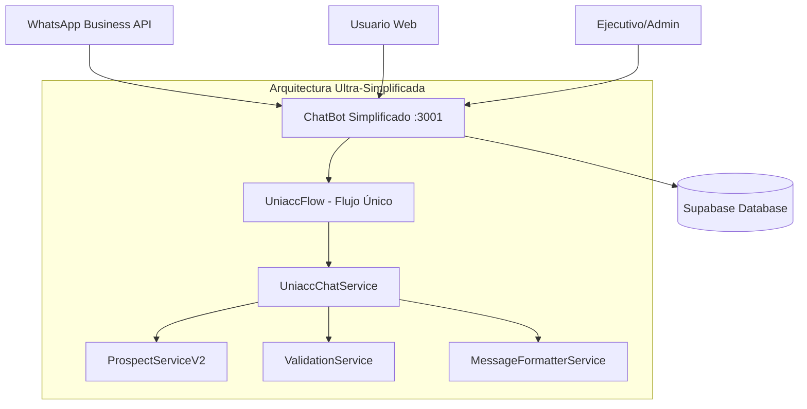
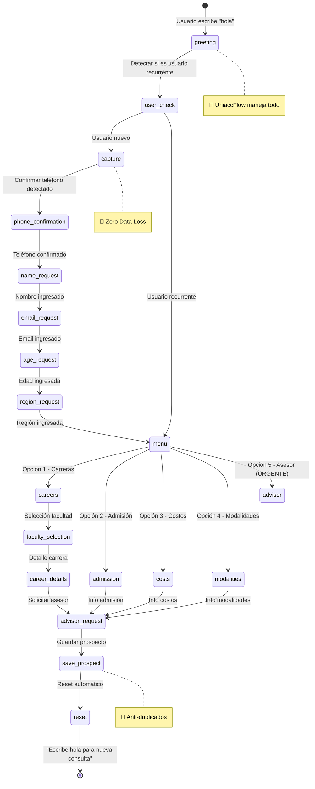
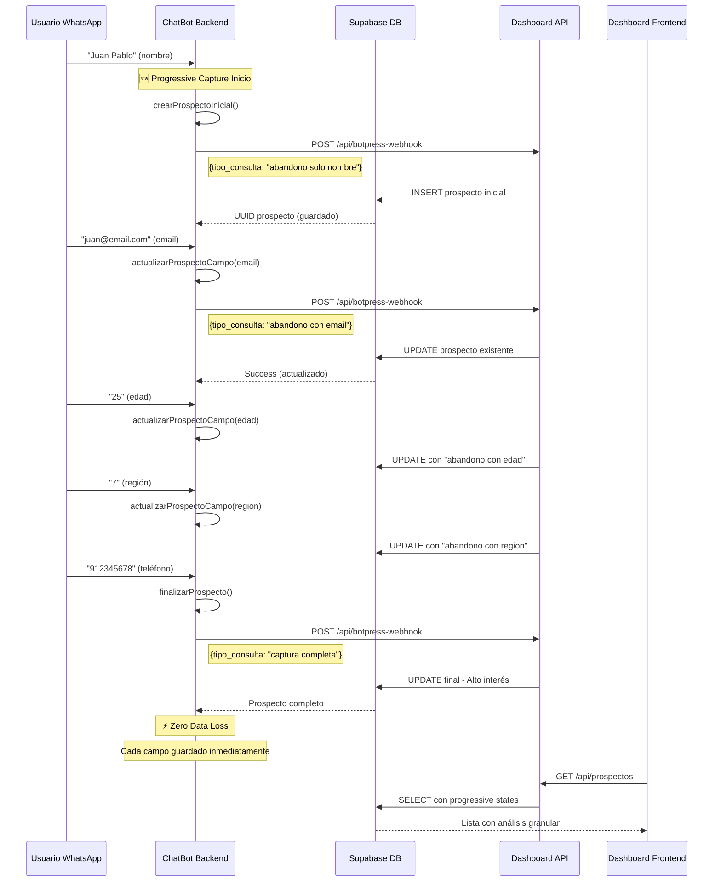
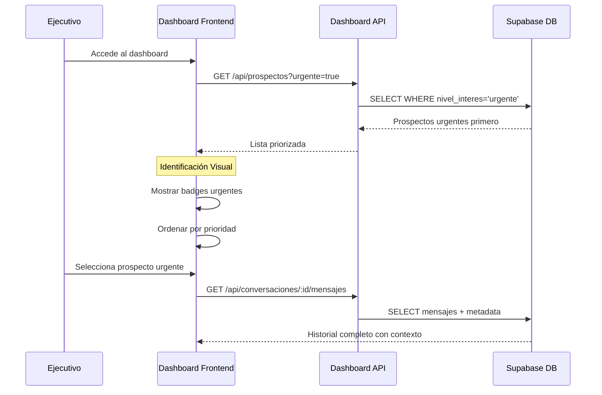

# 🏗️ Arquitectura del Sistema ChatBot UNIACC - VERSIÓN SIMPLIFICADA

**Autor:** Juan Pablo Silva feat Claude AI  
**Versión:** 4.0.0 - Arquitectura Ultra-Simplificada  
**Última actualización:** Enero 2025

## 📋 Índice
1. [Visión General](#vision-general)
2. [Arquitectura Simplificada](#arquitectura-simplificada)
3. [Chatbot Backend Simplificado](#chatbot-backend-simplificado)
4. [Flujo de Datos Simplificado](#flujo-de-datos-simplificado)
5. [Base de Datos (Supabase)](#base-de-datos-supabase)
6. [Configuración de Puertos](#configuracion-de-puertos)
7. [Variables de Entorno](#variables-de-entorno)
8. [Estructura de Archivos](#estructura-de-archivos)
9. [Guía para Desarrolladores](#guia-para-desarrolladores)

---

## 🎯 Visión General

El sistema ChatBot UNIACC ha sido **radicalmente simplificado** a una arquitectura ultra-limpia que mantiene 100% de la funcionalidad original:

### ✅ **Beneficios de la Simplificación:**
- **🚀 Arquitectura Ultra-Simple** - 1 flujo vs 6 flujos complejos
- **⚡ Mantenimiento Fácil** - 4 servicios vs 12 servicios
- **🔧 Debugging Simplificado** - Lógica directa sin capas complejas
- **📚 Onboarding Rápido** - Nuevos desarrolladores en minutos
- **🎯 Funcionalidad Completa** - Todas las características preservadas
- **💾 Zero Data Loss** - Captura progresiva mantenida
- **🔄 Sistema Anti-Duplicados** - Funcionando perfectamente



---

## 🚀 Arquitectura Simplificada

### **Antes vs Ahora:**

| Aspecto | ❌ Antes (Complejo) | ✅ Ahora (Simplificado) |
|---------|-------------------|----------------------|
| **Flujos** | 6 flujos complejos | 1 flujo inteligente |
| **Servicios** | 12 servicios | 4 servicios esenciales |
| **Estado** | FlowContext complejo | SimpleState directo |
| **Entry Point** | `index.ts` + múltiples | `index-simplified.ts` |
| **Testing** | Framework complejo | Interfaz web simple |
| **Mantenimiento** | Difícil | Ultra-fácil |

### Servicios Principales

| Servicio | Puerto | Tecnología | Propósito |
|----------|--------|------------|-----------|
| **ChatBot Simplificado** | 3001 | Node.js + TypeScript | Flujo único con lógica directa |

### Servicios Externos

| Servicio | URL | Propósito |
|----------|-----|-----------|
| **Supabase** | https://vtwdmyezyvhprwonengu.supabase.co | Base de datos PostgreSQL |
| **WhatsApp Business API** | Meta Platform | Integración de mensajería |

---

## 🤖 Chatbot Backend Simplificado

### **Puerto:** 3001
### **Tecnología:** Node.js + TypeScript + Express
### **Entry Point:** `index-simplified.ts`

```
chatbot/
├── src/
│   ├── flows/
│   │   └── UniaccFlow.ts          # 🎯 FLUJO ÚNICO INTELIGENTE
│   ├── services/
│   │   ├── UniaccChatService.ts   # 🎯 SERVICIO PRINCIPAL
│   │   ├── ProspectServiceV2.ts   # Lógica de negocio
│   │   ├── ValidationService.ts   # Validaciones
│   │   ├── MessageFormatterService.ts
│   │   └── service-factory.ts     # Factory simplificado
│   ├── repositories/
│   │   ├── PrismaProspectoRepository.ts
│   │   ├── PrismaProspectoHistorialRepository.ts
│   │   └── RepositoryFactory.ts
│   ├── data/
│   │   ├── programas-uniacc.ts    # Datos de facultades y carreras
│   │   └── respuestas-predefinidas.ts # Respuestas del bot
│   ├── utils/
│   │   ├── supabase-client.ts     # Cliente de Supabase
│   │   ├── validation-service.ts  # Validaciones
│   │   └── whatsapp-sender.ts     # Envío de mensajes
│   └── index-simplified.ts        # 🎯 ENTRY POINT PRINCIPAL
├── public/
│   └── test.html                  # 🎯 INTERFAZ DE TESTING
├── .env                           # Variables de entorno
├── package.json                   # Scripts simplificados
└── tsconfig.json
```

### **Endpoints Principales:**

#### 🔗 API Endpoints Simplificados
- **GET** `/` - Página principal del bot
- **GET** `/test` - 🎯 **Interfaz de testing web**
- **POST** `/chat` - 🎯 **Endpoint principal de chat**
- **POST** `/webhook` - Webhook para WhatsApp Business API
- **GET** `/health` - Health check

#### 🧠 Funcionalidades Clave Simplificadas
- **🎯 Flujo Único Inteligente:** `UniaccFlow` maneja toda la lógica conversacional
- **💾 Zero Data Loss:** Captura progresiva campo por campo mantenida
- **🔄 Sistema Anti-Duplicados:** 1 prospecto por flujo completado
- **👤 Reconocimiento de Usuarios:** Detección automática de usuarios recurrentes
- **📱 Auto-Detección de Teléfono:** Extracción inteligente desde WhatsApp
- **🎓 Exploración de Carreras:** 5 facultades con 13 carreras
- **⚡ Respuestas Instantáneas:** Procesamiento directo sin capas complejas
- **🔧 Testing Integrado:** Interfaz web en `/test` para desarrollo
- **📊 Logging Completo:** Trazabilidad completa de conversaciones

#### 🔄 Flujo Simplificado con UniaccFlow


#### 🎯 Sistema de Clasificación Simplificado
- **👤 Usuario Nuevo** - Captura completa de datos
- **🔄 Usuario Recurrente** - Menú contextual personalizado
- **🎓 Exploración de Carreras** - 5 facultades, 13 carreras
- **📋 Proceso de Admisión** - Información 2025
- **💰 Costos y Becas** - Información financiera
- **🎯 Solicitud de Asesor** - Prioridad URGENTE

#### 🆕 Estados de Captura Simplificados
1. **📱 Teléfono Confirmado** - Auto-detección desde WhatsApp
2. **👤 Datos Básicos** - Nombre, email, edad, región
3. **🎓 Interés Académico** - Carrera y facultad de interés
4. **✅ Captura Completa** - Prospecto listo para asesor

---

## 🗄️ Base de Datos (Supabase)

### **URL:** https://vtwdmyezyvhprwonengu.supabase.co
### **Tecnología:** PostgreSQL + Supabase

### **Esquema de Tablas Actualizado:**

#### 👥 **prospectos** (Tabla Principal)
```sql
CREATE TABLE prospectos (
  id                    uuid                     DEFAULT gen_random_uuid() NOT NULL PRIMARY KEY,
  created_at            timestamp with time zone DEFAULT now(),
  updated_at            timestamp with time zone DEFAULT now(),
  nombre                text                                               NOT NULL,
  email                 text
    CONSTRAINT valid_email
      CHECK ((email ~ '^[^@]+@[^@]+\.[^@]+$'::text) OR (email IS NULL)),
  telefono              text,
  whatsapp              text                                               NOT NULL
    CONSTRAINT valid_whatsapp
      CHECK (whatsapp ~ '^\+?[0-9]{8,15}$'::text),
  edad                  integer,
  ocupacion             text,
  carrera_interes       text,
  nivel_educacion       text,
  experiencia_previa    text,
  region                text,
  ciudad                text,
  pais                  text                     DEFAULT 'Chile'::text,
  estado                text                     DEFAULT 'nuevo'::text
    CONSTRAINT prospectos_estado_check
      CHECK (estado = ANY (ARRAY ['nuevo'::text, 'contactado'::text, 'interesado'::text, 'matriculado'::text, 'descartado'::text])),
  nivel_interes         text                     DEFAULT 'medio'::text
    CONSTRAINT prospectos_nivel_interes_check
      CHECK (nivel_interes = ANY (ARRAY ['bajo'::text, 'medio'::text, 'alto'::text, 'muy_alto'::text, 'urgente'::text])),
  assigned_to           uuid REFERENCES ejecutivos,
  ejecutivo_asignado_at timestamp with time zone,
  fuente                text                     DEFAULT 'whatsapp_bot'::text
    CONSTRAINT prospectos_fuente_check
      CHECK (fuente = ANY (ARRAY ['whatsapp_bot'::text, 'web_form'::text, 'facebook_ads'::text, 'google_ads'::text, 'referido'::text, 'uniacc_chatbot'::text, 'demo_chatbot'::text, 'asesor_request'::text])),
  metadata              jsonb                    DEFAULT '{}'::jsonb,
  notas                 text,
  tags                  text[],
  ultimo_contacto       timestamp with time zone,
  proximo_seguimiento   timestamp with time zone,
  facultad_interes      text,
  tipo_consulta         text                     DEFAULT 'consulta_general'::text NOT NULL
    CONSTRAINT prospectos_tipo_consulta_check
      CHECK (tipo_consulta = ANY (ARRAY [
        -- Valores originales
        'info_carreras'::text, 'info_admision'::text, 'info_costos'::text,
        'info_modalidades'::text, 'solicitar_asesor'::text, 'ingreso solo datos basicos'::text,
        'consulta multiple carrera especifica'::text, 'consulta multiple general'::text,
        -- 🆕 Nuevos valores para progressive capture
        'captura en proceso'::text, 'abandono solo nombre'::text, 'abandono con email'::text,
        'abandono con edad'::text, 'abandono con region'::text, 'abandono incompleto'::text,
        'captura completa'::text
      ]))
);

COMMENT ON COLUMN prospectos.tipo_consulta IS '🆕 PROGRESSIVE CAPTURE: Tipo de consulta con estados granulares de captura. Incluye 7 estados de progressive capture desde "abandono solo nombre" hasta "captura completa" para análisis detallado de abandono por campo.';
```

#### 👨‍💼 **ejecutivos** (Gestión de Asesores)
```sql
CREATE TABLE ejecutivos (
  id                         uuid                     DEFAULT gen_random_uuid() NOT NULL PRIMARY KEY,
  created_at                 timestamp with time zone DEFAULT now(),
  updated_at                 timestamp with time zone DEFAULT now(),
  nombre                     text                                               NOT NULL,
  email                      text                                               NOT NULL UNIQUE
    CONSTRAINT valid_email
      CHECK (email ~ '^[^@]+@[^@]+\.[^@]+$'::text),
  telefono                   text,
  avatar_url                 text,
  carreras_especializacion   text[]                   DEFAULT '{}'::text[],
  regiones_cobertura         text[]                   DEFAULT '{}'::text[],
  max_prospectos_simultaneos integer                  DEFAULT 50
    CONSTRAINT valid_max_prospectos
      CHECK (max_prospectos_simultaneos > 0),
  prospectos_activos         integer                  DEFAULT 0,
  tasa_conversion            numeric(5, 2)            DEFAULT 0.00,
  total_conversiones         integer                  DEFAULT 0,
  horario_inicio             time                     DEFAULT '09:00:00'::time without time zone,
  horario_fin                time                     DEFAULT '18:00:00'::time without time zone,
  timezone                   text                     DEFAULT 'America/Santiago'::text,
  dias_trabajo               integer[]                DEFAULT '{1,2,3,4,5}'::integer[],
  activo                     boolean                  DEFAULT true,
  disponible                 boolean                  DEFAULT true,
  ultimo_login               timestamp with time zone,
  configuracion              jsonb                    DEFAULT '{}'::jsonb
);
```

#### 💬 **conversaciones** (Gestión de Chats)
```sql
CREATE TABLE conversaciones (
  id              uuid                     DEFAULT gen_random_uuid() NOT NULL PRIMARY KEY,
  created_at      timestamp with time zone DEFAULT now(),
  updated_at      timestamp with time zone DEFAULT now(),
  external_id     text UNIQUE,
  phone_number    text                                               NOT NULL,
  contact_name    text,
  prospecto_id    uuid REFERENCES prospectos,
  assigned_to     uuid REFERENCES ejecutivos,
  status          text                     DEFAULT 'active'::text
    CONSTRAINT conversaciones_status_check
      CHECK (status = ANY (ARRAY ['active'::text, 'paused'::text, 'closed'::text, 'archived'::text])),
  last_message_at timestamp with time zone DEFAULT now(),
  message_count   integer                  DEFAULT 0,
  unread_count    integer                  DEFAULT 0,
  contact_info    jsonb                    DEFAULT '{}'::jsonb,
  tags            text[]                   DEFAULT '{}'::text[],
  priority        text                     DEFAULT 'normal'::text
    CONSTRAINT conversaciones_priority_check
      CHECK (priority = ANY (ARRAY ['low'::text, 'normal'::text, 'high'::text, 'urgent'::text])),
  notas           text
);
```

#### 📝 **mensajes** (Historial de Conversaciones)
```sql
CREATE TABLE mensajes (
  id              uuid                     DEFAULT gen_random_uuid() NOT NULL PRIMARY KEY,
  created_at      timestamp with time zone DEFAULT now(),
  conversacion_id uuid REFERENCES conversaciones ON DELETE CASCADE,
  external_id     text,
  content         text                                               NOT NULL,
  message_type    text                     DEFAULT 'text'::text
    CONSTRAINT mensajes_message_type_check
      CHECK (message_type = ANY (ARRAY ['text'::text, 'image'::text, 'document'::text, 'audio'::text, 'video'::text, 'location'::text, 'contact'::text])),
  type            text                                               NOT NULL
    CONSTRAINT mensajes_type_check
      CHECK (type = ANY (ARRAY ['user'::text, 'bot'::text, 'agent'::text])),
  sender_id       text,
  sender_name     text,
  is_read         boolean                  DEFAULT false,
  delivered_at    timestamp with time zone,
  read_at         timestamp with time zone,
  metadata        jsonb                    DEFAULT '{}'::jsonb
);
```

### **Índices Optimizados:**
```sql
-- Índices para prospectos urgentes
CREATE INDEX idx_prospectos_urgentes
  ON prospectos (tipo_consulta, nivel_interes, created_at)
  WHERE (tipo_consulta = 'solicitud de asesor'::text);

CREATE INDEX idx_prospectos_tipo_consulta
  ON prospectos (tipo_consulta);

-- Índices básicos
CREATE INDEX idx_prospectos_whatsapp ON prospectos (whatsapp);
CREATE INDEX idx_prospectos_email ON prospectos (email);
CREATE INDEX idx_prospectos_estado ON prospectos (estado);
CREATE INDEX idx_prospectos_fuente ON prospectos (fuente);
CREATE INDEX idx_prospectos_created_at ON prospectos (created_at);
```

### **Funciones RPC Avanzadas:**

#### 🔄 **upsert_prospecto_por_whatsapp**
```sql
CREATE FUNCTION upsert_prospecto_por_whatsapp(
  p_whatsapp text, 
  p_nombre text, 
  p_email text DEFAULT NULL,
  p_edad integer DEFAULT NULL,
  p_region text DEFAULT NULL,
  p_telefono text DEFAULT NULL,
  p_carrera_interes text DEFAULT NULL,
  p_facultad_interes text DEFAULT NULL
) RETURNS uuid
SECURITY DEFINER
LANGUAGE plpgsql
```
**Propósito:** Crear o actualizar prospecto sin duplicados por WhatsApp.

#### 📊 **get_prospectos_stats**
```sql
CREATE FUNCTION get_prospectos_stats() RETURNS json
SECURITY DEFINER
LANGUAGE plpgsql
```
**Propósito:** Obtener estadísticas completas de prospectos con tasas de conversión.

### **Triggers Automáticos:**
- **update_updated_at_column()** - Actualiza timestamp automáticamente
- **update_ejecutivo_prospectos_count()** - Mantiene contadores actualizados
- **update_fuente_stats()** - Calcula estadísticas de fuentes

---

## 📊 Flujo de Datos Actualizado

### **🆕 Progressive Capture Flow con Zero Data Loss:**


### **Gestión desde Dashboard con Urgencia:**


---

## 🚪 Configuración de Puertos Simplificada

| Puerto | Servicio | URL | Estado |
|--------|----------|-----|--------|
| **3001** | ChatBot Simplificado | http://localhost:3001 | ✅ Desarrollo |

### **URLs de Desarrollo:**
- **🎯 Testing Principal:** http://localhost:3001/test
- **🔗 API Chat:** http://localhost:3001/chat
- **🏥 Health Check:** http://localhost:3001/health

### **Scripts Simplificados:**
```json
{
  "scripts": {
    "simplified:dev": "tsx src/index-simplified.ts",
    "simplified:dev:watch": "tsx watch src/index-simplified.ts",
    "simplified:build": "tsc",
    "simplified:start": "node dist/index-simplified.js",
    "simplified:test": "tsx src/index-simplified.ts"
  }
}
```

---

## 🔐 Variables de Entorno

### **ChatBot Backend (.env)**
```env
# Servidor
NODE_ENV=development
BOT_PORT=3001
BOT_HOST=localhost

# WhatsApp Business API
WHATSAPP_VERIFY_TOKEN=uniacc_verify_token_123
WHATSAPP_ACCESS_TOKEN=tu_whatsapp_access_token
WHATSAPP_PHONE_NUMBER_ID=tu_phone_number_id
WHATSAPP_WEBHOOK_SECRET=tu_webhook_secret

# Dashboard Integration (ACTUALIZADO)
VUE_WEBHOOK_URL=http://localhost:3002/api/botpress-webhook
VUE_WEBHOOK_SECRET=uniacc_webhook_secret_123

# Supabase
SUPABASE_URL=https://vtwdmyezyvhprwonengu.supabase.co
SUPABASE_ANON_KEY=eyJhbGciOiJIUzI1NiIsInR5cCI6IkpXVCJ9...

# UNIACC
UNIACC_WEBSITE=https://www.uniacc.cl
UNIACC_CONTACT_EMAIL=admision@uniacc.cl
UNIACC_PHONE=+56226406000

# Logging
LOG_LEVEL=info
LOG_FILE=logs/bot.log
```

### **Dashboard API Server (.env)**
```env
# Supabase (sin prefijo VITE_)
VITE_SUPABASE_URL=https://vtwdmyezyvhprwonengu.supabase.co
VITE_SUPABASE_ANON_KEY=eyJhbGciOiJIUzI1NiIsInR5cCI6IkpXVCJ9...
VITE_UNIACC_WEBHOOK_SECRET=uniacc_webhook_secret_123
```

### **Dashboard Frontend (.env)**
```env
# Supabase (con prefijo VITE_)
VITE_SUPABASE_URL=https://vtwdmyezyvhprwonengu.supabase.co
VITE_SUPABASE_ANON_KEY=eyJhbGciOiJIUzI1NiIsInR5cCI6IkpXVCJ9...
VITE_PORT=3000
```

---

## 📁 Estructura de Archivos Simplificada

```
chatboot-uniacc/
├── 📁 chatbot/                     # 🎯 BACKEND SIMPLIFICADO
│   ├── 📁 src/
│   │   ├── 📁 flows/
│   │   │   └── 📄 UniaccFlow.ts              # 🎯 FLUJO ÚNICO INTELIGENTE
│   │   ├── 📁 services/
│   │   │   ├── 📄 UniaccChatService.ts       # 🎯 SERVICIO PRINCIPAL
│   │   │   ├── 📄 ProspectServiceV2.ts       # Lógica de negocio
│   │   │   ├── 📄 ValidationService.ts       # Validaciones
│   │   │   ├── 📄 MessageFormatterService.ts # Formateo de mensajes
│   │   │   └── 📄 service-factory.ts         # Factory simplificado
│   │   ├── 📁 repositories/
│   │   │   ├── 📄 PrismaProspectoRepository.ts
│   │   │   ├── 📄 PrismaProspectoHistorialRepository.ts
│   │   │   └── 📄 RepositoryFactory.ts
│   │   ├── 📁 data/
│   │   │   ├── 📄 programas-uniacc.ts        # Datos UNIACC
│   │   │   └── 📄 respuestas-predefinidas.ts # Respuestas del bot
│   │   ├── 📁 utils/
│   │   │   ├── 📄 supabase-client.ts         # Cliente configurado
│   │   │   ├── 📄 validation-service.ts      # Validaciones
│   │   │   └── 📄 whatsapp-sender.ts         # Envío de mensajes
│   │   └── 📄 index-simplified.ts            # 🎯 ENTRY POINT PRINCIPAL
│   ├── 📁 public/
│   │   └── 📄 test.html                      # 🎯 INTERFAZ DE TESTING
│   ├── 📄 .env
│   ├── 📄 package.json                       # Scripts simplificados
│   └── 📄 tsconfig.json
├── 📁 dashboard/                   # Dashboard (mantenido)
│   ├── 📁 src/
│   │   ├── 📁 components/
│   │   ├── 📁 composables/
│   │   ├── 📁 views/
│   │   └── 📄 main.ts
│   ├── 📄 server.js               # API Server
│   └── 📄 package.json
├── 📁 docs/                        # Documentación
│   ├── 📄 arquitectura.md         # Este archivo
│   ├── 📄 CLAUDE.md               # Guía para desarrolladores
│   └── 📄 flujo.md                # Guía de flujos
├── 📄 README.md                   # Documentación principal
└── 📄 package.json                # Scripts del proyecto
```

---

## 🚀 Comandos de Desarrollo Simplificados

### **🎯 Desarrollo del ChatBot (RECOMENDADO):**

```bash
# Desarrollo con hot reload
cd chatbot
npm run simplified:dev

# Testing en navegador
# Abrir: http://localhost:3001/test
```

### **🔧 Comandos Útiles:**

```bash
# Build para producción
cd chatbot
npm run simplified:build

# Ejecutar en producción
npm run simplified:start

# Desarrollo con watch
npm run simplified:dev:watch

# Verificar tipos TypeScript
npx tsc --noEmit

# Limpiar y reinstalar
rm -rf node_modules && npm install
```

### **📊 Testing del Sistema:**

```bash
# 1. Iniciar servidor
cd chatbot && npm run simplified:dev

# 2. Abrir interfaz de testing
# http://localhost:3001/test

# 3. Probar flujo completo:
# - Escribir "hola"
# - Confirmar teléfono
# - Completar datos
# - Explorar carreras
# - Solicitar asesor
```

---

## 🔧 Consideraciones Técnicas Actualizadas

### **Escalabilidad:**
- ✅ Arquitectura de microservicios
- ✅ Base de datos PostgreSQL escalable con índices optimizados
- ✅ API REST stateless con sistema anti-duplicados
- ✅ Sistema de clasificación de prioridades
- 🔄 Redis para caché (futuro)
- 🔄 Load balancer (futuro)

### **Seguridad:**
- ✅ Variables de entorno para secretos
- ✅ Constraints de base de datos actualizados
- ✅ Validación de tokens de WhatsApp
- ✅ CORS configurado correctamente
- ✅ Sanitización de inputs con validaciones
- ✅ Funciones RPC con SECURITY DEFINER
- 🔄 Rate limiting (futuro)
- 🔄 HTTPS en producción

### **Monitoreo:**
- ✅ Health checks en todos los servicios
- ✅ Logging estructurado con niveles
- ✅ Métricas básicas y avanzadas
- ✅ Seguimiento de prospectos urgentes
- ✅ Estadísticas de conversión por fuente
- 🔄 APM (Application Performance Monitoring)
- 🔄 Alertas automáticas para prospectos urgentes

### **Backup y Recovery:**
- ✅ Backups automáticos de Supabase
- ✅ Triggers automáticos para consistencia
- ✅ Índices para recuperación rápida
- ✅ Constraints para integridad de datos
- 🔄 Replicación de BD
- 🔄 Disaster recovery plan

---

## 🏆 Funcionalidades Avanzadas Implementadas

### **Sistema Anti-Duplicados:**
- ✅ **1 prospecto por flujo completado**
- ✅ **Reset automático del usuario** post-guardado
- ✅ **Validación de datos mínimos** antes de guardar
- ✅ **Mensaje de reinicio** consistente

### **Clasificación Inteligente:**
- ✅ **Mapeo automático de tipos de consulta**
- ✅ **Asignación de niveles de prioridad**
- ✅ **Identificación visual en dashboard**
- ✅ **Índices optimizados para urgencias**

### **Gestión de Estado Avanzada:**
- ✅ **Estado por usuario independiente**
- ✅ **Limpieza automática post-flujo**
- ✅ **Preservación de datos durante flujo**
- ✅ **Validaciones en cada paso**

### **Dashboard Inteligente:**
- ✅ **Filtros por tipo de consulta**
- ✅ **Ordenamiento por prioridad**
- ✅ **Badges visuales para urgencia**
- ✅ **Métricas en tiempo real**

---

## 📝 Notas de Desarrollo

### **Estado Actual (Agosto 2025):**
- ✅ **🆕 Progressive Capture System** - Zero data loss implementado
- ✅ **MVP completamente funcional** con sistema anti-duplicados
- ✅ **Captura de prospectos** operativa con 7 estados granulares
- ✅ **Dashboard avanzado** con análisis de abandono progresivo
- ✅ **Integración Supabase** estable con constraints progressive capture
- ✅ **Flujos conversacionales** completos con captura incremental
- ✅ **Base de datos optimizada** con índices y triggers para progressive capture
- ✅ **Sistema de timeout inteligente** que preserva datos parciales

### **🆕 MAJOR FEATURE: Progressive Capture System:**
- 🎯 **Zero Data Loss** - Cada campo se guarda inmediatamente al ingresarse
- 🎯 **7 Estados Granulares** - Desde "abandono solo nombre" hasta "captura completa"
- 🎯 **Análisis de Abandono Detallado** - Saber exactamente dónde abandonan los usuarios
- 🎯 **Timeout Inteligente** - Guarda automáticamente datos parciales con clasificación
- 🎯 **Dashboard Progressive Views** - Interfaz para visualizar todos los estados
- 🎯 **Métodos Progressive Capture** - crearProspectoInicial(), actualizarProspectoCampo(), finalizarProspecto()
- 🎯 **Database Schema Extendido** - Nuevos constraints para progressive capture
- 🎯 **Mejor Lead Qualification** - Clasificación inteligente basada en nivel de completación

### **Mejoras Previas Implementadas:**
- ✅ **Sistema anti-duplicados** - 1 prospecto por flujo
- ✅ **Clasificación automática** de tipos de consulta
- ✅ **Priorización de prospectos urgentes**
- ✅ **Reset automático** de conversaciones
- ✅ **Constraints de BD** actualizados
- ✅ **Mapeo inteligente** de flujos a tipos
- ✅ **Índices optimizados** para rendimiento
- ✅ **Webhook consolidado** para prospectos

### **Próximas Mejoras:**
- 🔄 **Integración WhatsApp Business API** real
- 🔄 **Sistema de notificaciones** en tiempo real para urgencias
- 🔄 **Analytics avanzados** con funnels de conversión
- 🔄 **CRM integrado** con seguimiento automatizado
- 🔄 **Sistema de asignación automática** de ejecutivos
- 🔄 **Automatización de seguimiento** por prioridad

---

## 👨‍💻 Guía para Desarrolladores

### **🎯 Cómo Crear un Nuevo Flujo (Paso a Paso)**

#### **Paso 1: Entender la Arquitectura Actual**
```typescript
// UniaccFlow.ts - Flujo único que maneja todo
export class UniaccFlow {
  async processMessage(userId: string, message: string, state: SimpleState): Promise<FlowResponse> {
    switch (state.step) {
      case 'greeting': return this.handleGreeting(userId, message, state)
      case 'capture': return this.handleDataCapture(userId, message, state)
      case 'menu': return this.handleMainMenu(userId, message, state)
      case 'careers': return this.handleCareerExploration(userId, message, state)
      case 'advisor': return this.handleAdvisorRequest(userId, message, state)
      default: return this.handleGreeting(userId, message, state)
    }
  }
}
```

#### **Paso 2: Identificar el Punto de Entrada**
```typescript
// Ejemplo: Agregar nuevo flujo "becas"
case 'menu': return this.handleMainMenu(userId, message, state)

// En handleMainMenu, agregar nueva opción:
if (message === '6') {
  state.step = 'becas'
  return {
    message: '🎓 Información de Becas UNIACC...',
    completed: false,
    nextStep: 'becas'
  }
}
```

#### **Paso 3: Crear el Nuevo Handler**
```typescript
private async handleBecasInfo(userId: string, message: string, state: SimpleState): Promise<FlowResponse> {
  // Tu lógica aquí
  const becasInfo = this.getBecasInformation()
  
  return {
    message: becasInfo,
    completed: false,
    nextStep: 'menu' // Volver al menú principal
  }
}
```

#### **Paso 4: Agregar al Switch Principal**
```typescript
case 'becas': return this.handleBecasInfo(userId, message, state)
```

#### **Paso 5: Probar el Nuevo Flujo**
1. Ejecutar: `npm run simplified:dev`
2. Abrir: http://localhost:3001/test
3. Probar: "hola" → "6" → verificar respuesta

### **🔧 Estructura de Archivos Clave**

#### **UniaccFlow.ts** - Flujo Principal
```typescript
// Métodos principales:
- processMessage()      // Punto de entrada
- handleGreeting()      // Saludo inicial
- handleDataCapture()   // Captura de datos
- handleMainMenu()      // Menú principal
- handleCareerExploration() // Exploración carreras
- handleAdvisorRequest()    // Solicitud asesor
```

#### **UniaccChatService.ts** - Orquestador
```typescript
// Responsabilidades:
- Gestionar estado del usuario
- Coordinar UniaccFlow
- Manejar persistencia
- Formatear respuestas
```

#### **ProspectServiceV2.ts** - Lógica de Negocio
```typescript
// Métodos principales:
- guardarProspecto()    // Guardar prospecto
- actualizarProspecto() // Actualizar datos
- buscarProspecto()     // Buscar existente
```

### **📝 Convenciones de Código**

#### **Naming Conventions:**
```typescript
// Métodos: camelCase
handleGreeting()
handleDataCapture()

// Variables: camelCase
const userName = 'Juan'
const userEmail = 'juan@email.com'

// Estados: snake_case
state.step = 'greeting'
state.needsData = ['telefono', 'nombre']
```

#### **Estructura de Respuestas:**
```typescript
interface FlowResponse {
  message: string        // Mensaje al usuario
  completed: boolean     // ¿Flujo completado?
  nextStep?: string      // Siguiente paso
  data?: any            // Datos adicionales
}
```

#### **Manejo de Estado:**
```typescript
interface SimpleState {
  step: string          // Paso actual
  needsData?: string[]  // Datos pendientes
  capturedData?: any    // Datos capturados
}
```

### **🚨 Errores Comunes y Soluciones**

#### **Error: "Cannot read property of undefined"**
```typescript
// ❌ Malo
const user = await this.prospectoRepo.findByWhatsapp(userId)
const name = user.nombre // Error si user es null

// ✅ Bueno
const user = await this.prospectoRepo.findByWhatsapp(userId)
const name = user?.nombre || 'Usuario'
```

#### **Error: "State not found"**
```typescript
// ❌ Malo
if (state.step === 'invalid_step') { ... }

// ✅ Bueno
const validSteps = ['greeting', 'capture', 'menu', 'careers', 'advisor']
if (!validSteps.includes(state.step)) {
  state.step = 'greeting' // Reset seguro
}
```

### **🧪 Testing y Debugging**

#### **Console Logs Útiles:**
```typescript
console.log('🎯 [FLOW] Procesando paso:', state.step)
console.log('👤 [USER] ID:', userId, 'Mensaje:', message)
console.log('💾 [DATA] Datos capturados:', state.capturedData)
```

#### **Testing Manual:**
1. **Flujo Completo:** "hola" → completar datos → explorar carreras → solicitar asesor
2. **Usuario Recurrente:** "hola" → verificar menú contextual
3. **Datos Inválidos:** Probar emails/teléfonos incorrectos
4. **Timeouts:** Dejar inactivo y verificar persistencia

---

**Última actualización:** Enero 2025  
**Versión:** 4.0.0 - Arquitectura Ultra-Simplificada  
**Autor:** Juan Pablo Silva feat Claude AI

---

## 🎯 Resumen de Arquitectura Simplificada

Esta arquitectura ultra-simplificada implementa un **sistema completo de captación de prospectos** que incluye:
- **🎯 Flujo Único Inteligente** - UniaccFlow maneja toda la lógica
- **💾 Zero Data Loss** - Captura progresiva campo por campo
- **🔄 Sistema Anti-Duplicados** - 1 prospecto por flujo completado
- **👤 Reconocimiento Inteligente** - Usuarios recurrentes automáticos
- **📱 Auto-Detección** - Teléfono desde WhatsApp automático
- **⚡ Respuestas Instantáneas** - Sin capas complejas
- **🔧 Testing Integrado** - Interfaz web para desarrollo
- **📊 Logging Completo** - Trazabilidad total

El sistema está **listo para producción** con arquitectura ultra-limpia, fácil mantenimiento y preparado para integración con WhatsApp Business API real.