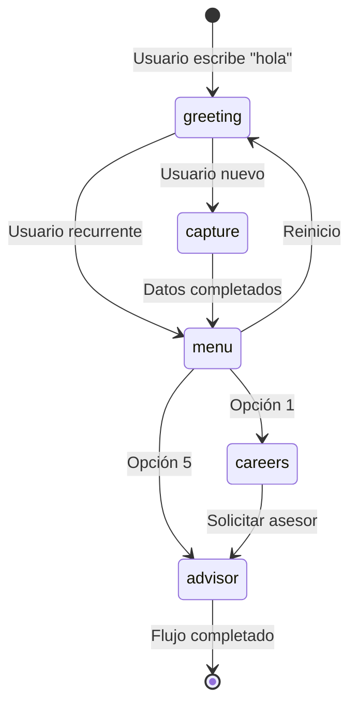

# 🎓 GUÍA COMPLETA DE FLUJOS - UNIACC CHATBOT SIMPLIFICADO

## 📋 ÍNDICE
1. [Introducción para Desarrolladores Junior](#introducción-para-desarrolladores-junior)
2. [Arquitectura Simplificada](#arquitectura-simplificada)
3. [Flujo Principal: UniaccFlow](#flujo-principal-uniaccflow)
4. [Estados y Transiciones](#estados-y-transiciones)
5. [Cómo Crear un Nuevo Flujo (Paso a Paso)](#cómo-crear-un-nuevo-flujo-paso-a-paso)
6. [Ejemplos Prácticos](#ejemplos-prácticos)
7. [Testing y Debugging](#testing-y-debugging)
8. [Errores Comunes y Soluciones](#errores-comunes-y-soluciones)

---

## 👨‍💻 Introducción para Desarrolladores Junior

### **¿Qué es un Chatbot Conversacional?**

Un chatbot conversacional es un programa que simula una conversación humana a través de texto. En nuestro caso, el chatbot de UNIACC ayuda a estudiantes potenciales a obtener información sobre la universidad.

**Ejemplo simple:**
```
Usuario: "hola"
Bot: "¡Hola! 👋 Detectamos que escribes desde +56912345678. ¿Es correcto tu número?"
Usuario: "sí"
Bot: "✅ Teléfono confirmado. ¿Cuál es tu nombre completo?"
```

### **¿Por qué se Simplificó el Sistema?**

**Antes (Complejo):**
- 6 flujos diferentes
- 12 servicios
- Sistema de contexto complejo
- Difícil de mantener

**Ahora (Simplificado):**
- 1 flujo único
- 4 servicios
- Estado simple
- Fácil de entender y modificar

### **Conceptos Básicos que Necesitas Saber:**

#### **1. Estado (State)**
El estado es la "memoria" del chatbot para cada usuario. Guarda:
- ¿En qué paso está el usuario?
- ¿Qué datos ha capturado?
- ¿Qué necesita saber aún?

```typescript
// Ejemplo de estado
const userState = {
  step: 'capture',           // Paso actual
  needsData: ['nombre', 'email'], // Datos pendientes
  capturedData: {            // Datos ya capturados
    telefono: '+56912345678',
    nombre: 'Juan'
  }
}
```

#### **2. Flujo (Flow)**
Un flujo es la secuencia de pasos que sigue una conversación:
1. Saludo inicial
2. Captura de datos
3. Menú principal
4. Exploración de carreras
5. Solicitud de asesor

#### **3. Handler (Manejador)**
Un handler es una función que procesa un mensaje específico del usuario:

```typescript
// Ejemplo de handler
private async handleGreeting(userId: string, message: string, state: SimpleState): Promise<FlowResponse> {
  // Lógica para procesar el saludo
  return {
    message: '¡Hola! ¿Cómo estás?',
    completed: false,
    nextStep: 'capture'
  }
}
```

---

## 🏗️ Arquitectura Simplificada

### **Estructura del Sistema:**

```
UniaccFlow (Flujo Único)
    ↓
UniaccChatService (Orquestador)
    ↓
┌─────────────────┬─────────────────┬─────────────────┐
│ ProspectService │ ValidationService│ MessageFormatter│
│     V2          │                 │     Service     │
└─────────────────┴─────────────────┴─────────────────┘
    ↓
RepositoryFactory
    ↓
Supabase Database
```

### **Archivos Principales:**

| Archivo | Propósito | ¿Qué hace? |
|---------|-----------|------------|
| `UniaccFlow.ts` | 🎯 Flujo principal | Maneja toda la lógica conversacional |
| `UniaccChatService.ts` | 🎯 Orquestador | Coordina el flujo y servicios |
| `ProspectServiceV2.ts` | 💾 Persistencia | Guarda y recupera datos |
| `ValidationService.ts` | ✅ Validaciones | Verifica emails, teléfonos, etc. |
| `MessageFormatterService.ts` | 📝 Formateo | Formatea mensajes bonitos |

---

## 🎯 Flujo Principal: UniaccFlow

### **Método Principal: `processMessage()`**

Este es el "cerebro" del chatbot. Cada vez que un usuario envía un mensaje, se ejecuta este método:

```typescript
async processMessage(userId: string, message: string, state: SimpleState): Promise<FlowResponse> {
  // Determina qué handler usar según el paso actual
  switch (state.step) {
    case 'greeting': return this.handleGreeting(userId, message, state)
    case 'capture': return this.handleDataCapture(userId, message, state)
    case 'menu': return this.handleMainMenu(userId, message, state)
    case 'careers': return this.handleCareerExploration(userId, message, state)
    case 'advisor': return this.handleAdvisorRequest(userId, message, state)
    default: return this.handleGreeting(userId, message, state)
  }
}
```

### **Handlers Principales:**

#### **1. `handleGreeting()` - Saludo Inicial**
```typescript
private async handleGreeting(userId: string, message: string, state: SimpleState): Promise<FlowResponse> {
  // ¿Es un saludo?
  const isGreeting = this.isGreetingMessage(message)
  
  if (!isGreeting) {
    return {
      message: '¡Hola! 👋 Para empezar, escribe "hola" o "inicio".',
      completed: false
    }
  }

  // ¿Es usuario recurrente?
  const existingUser = await this.prospectoRepo.findByWhatsapp(userId)
  
  if (existingUser && existingUser.nombre) {
    // Usuario conocido - ir directo al menú
    state.step = 'menu'
    return {
      message: `¡Hola ${existingUser.nombre}! 👋 Me alegra verte de nuevo.\n\n${this.getMainMenu()}`,
      completed: false,
      nextStep: 'menu'
    }
  } else {
    // Usuario nuevo - captura de datos
    state.step = 'capture'
    state.needsData = ['telefono', 'nombre', 'email', 'edad', 'region']
    
    const phoneNumber = this.extractPhoneFromUserId(userId)
    return {
      message: `¡Hola! 👋 Detectamos que escribes desde ${phoneNumber}.\n\n¿Es correcto tu número?`,
      completed: false,
      nextStep: 'capture'
    }
  }
}
```

---

## 🔄 Estados y Transiciones

### **Estados Posibles:**

| Estado | Descripción | ¿Cuándo se usa? |
|--------|-------------|-----------------|
| `greeting` | Saludo inicial | Usuario nuevo o reinicio |
| `capture` | Captura de datos | Usuario nuevo necesita datos |
| `menu` | Menú principal | Usuario con datos completos |
| `careers` | Exploración carreras | Usuario eligió opción 1 |
| `advisor` | Solicitud asesor | Usuario eligió opción 5 |

### **Transiciones de Estado:**



---

## 🛠️ Cómo Crear un Nuevo Flujo (Paso a Paso)

### **Ejemplo: Crear Flujo de "Información de Becas"**

#### **Paso 1: Planificar el Flujo**
```
1. Usuario elige opción "6" en menú principal
2. Bot muestra información de becas
3. Bot pregunta si quiere más información
4. Si dice "sí", muestra detalles
5. Si dice "no", vuelve al menú principal
```

#### **Paso 2: Agregar al Switch Principal**
En `UniaccFlow.ts`, agregar al método `processMessage()`:

```typescript
switch (state.step) {
  case 'greeting': return this.handleGreeting(userId, message, state)
  case 'capture': return this.handleDataCapture(userId, message, state)
  case 'menu': return this.handleMainMenu(userId, message, state)
  case 'careers': return this.handleCareerExploration(userId, message, state)
  case 'advisor': return this.handleAdvisorRequest(userId, message, state)
  case 'becas': return this.handleBecasInfo(userId, message, state) // 🆕 NUEVO
  default: return this.handleGreeting(userId, message, state)
}
```

#### **Paso 3: Crear el Handler**
```typescript
private async handleBecasInfo(userId: string, message: string, state: SimpleState): Promise<FlowResponse> {
  const becasInfo = `🎓 BECAS DISPONIBLES EN UNIACC

🎯 BECAS PRINCIPALES:
1️⃣ Beca de Excelencia Académica (hasta 50%)
2️⃣ Beca Socioeconómica (hasta 40%)  
3️⃣ Beca Talento Artístico (hasta 60%)
4️⃣ Beca Hermanos UNIACC (15%)

¿Te gustaría más información sobre alguna beca específica?

1️⃣ Sí, quiero más detalles
2️⃣ No, tengo la información que necesitaba
3️⃣ Hablar con un asesor financiero`

  return {
    message: becasInfo,
    completed: false,
    nextStep: 'becas'
  }
}
```

#### **Paso 4: Probar el Nuevo Flujo**
1. Ejecutar: `npm run simplified:dev`
2. Abrir: http://localhost:3001/test
3. Probar: "hola" → completar datos → "6" → verificar información de becas

---

## 🧪 Testing y Debugging

### **Cómo Probar el Sistema:**

#### **1. Iniciar el Servidor:**
```bash
cd chatbot
npm run simplified:dev
```

#### **2. Abrir Interfaz de Testing:**
- URL: http://localhost:3001/test
- Interfaz web simple para probar conversaciones

#### **3. Casos de Prueba Básicos:**

**Caso 1: Usuario Nuevo Completo**
```
1. Escribir "hola"
2. Confirmar teléfono
3. Ingresar nombre
4. Ingresar email válido
5. Ingresar edad
6. Seleccionar región
7. Explorar carreras
8. Solicitar asesor
```

**Caso 2: Usuario Recurrente**
```
1. Escribir "hola" (debe reconocer usuario existente)
2. Verificar menú contextual
3. Probar opciones del menú
```

### **Logs de Debugging:**

#### **Console Logs Útiles:**
```typescript
// En cualquier handler
console.log('🎯 [FLOW] Procesando paso:', state.step)
console.log('👤 [USER] ID:', userId, 'Mensaje:', message)
console.log('💾 [DATA] Datos capturados:', state.capturedData)
console.log('🔄 [STATE] Estado actual:', state)
```

---

## 🚨 Errores Comunes y Soluciones

### **Error 1: "Cannot read property of undefined"**

**Problema:**
```typescript
const user = await this.prospectoRepo.findByWhatsapp(userId)
const name = user.nombre // Error si user es null
```

**Solución:**
```typescript
const user = await this.prospectoRepo.findByWhatsapp(userId)
const name = user?.nombre || 'Usuario' // ✅ Usar optional chaining
```

### **Error 2: "State not found"**

**Problema:**
```typescript
if (state.step === 'invalid_step') { ... }
```

**Solución:**
```typescript
const validSteps = ['greeting', 'capture', 'menu', 'careers', 'advisor']
if (!validSteps.includes(state.step)) {
  state.step = 'greeting' // ✅ Reset seguro
}
```

### **Error 3: "Promise not awaited"**

**Problema:**
```typescript
this.prospectoRepo.findByWhatsapp(userId) // ❌ Sin await
```

**Solución:**
```typescript
await this.prospectoRepo.findByWhatsapp(userId) // ✅ Con await
```

---

## 📚 Recursos Adicionales

### **Archivos de Referencia:**
- `src/flows/UniaccFlow.ts` - Flujo principal completo
- `src/services/UniaccChatService.ts` - Orquestador
- `src/data/programas-uniacc.ts` - Datos de carreras
- `src/data/respuestas-predefinidas.ts` - Mensajes del bot

### **Comandos Útiles:**
```bash
# Desarrollo
npm run simplified:dev

# Build
npm run simplified:build

# Verificar tipos
npx tsc --noEmit

# Testing
# Abrir http://localhost:3001/test
```

### **URLs Importantes:**
- **Testing**: http://localhost:3001/test
- **API**: http://localhost:3001/chat
- **Health**: http://localhost:3001/health
- **Supabase**: https://vtwdmyezyvhprwonengu.supabase.co

---

## 🎯 Resumen para Desarrolladores Junior

### **Lo Más Importante:**

1. **Un flujo único** maneja toda la conversación
2. **Cada handler** procesa un paso específico
3. **El estado** guarda la memoria del usuario
4. **Siempre retornar** una FlowResponse
5. **Probar todo** en http://localhost:3001/test

### **Flujo de Desarrollo:**
1. Modificar `UniaccFlow.ts`
2. Ejecutar `npm run simplified:dev`
3. Probar en http://localhost:3001/test
4. Verificar logs en consola
5. Revisar datos en Supabase

### **Cuando Tengas Dudas:**
1. Revisar el código existente
2. Usar console.log para debugging
3. Probar casos simples primero
4. Verificar la base de datos
5. Preguntar al equipo

---

**¡Recuerda: La simplicidad es la clave! El sistema está diseñado para ser fácil de entender y modificar. 🚀**